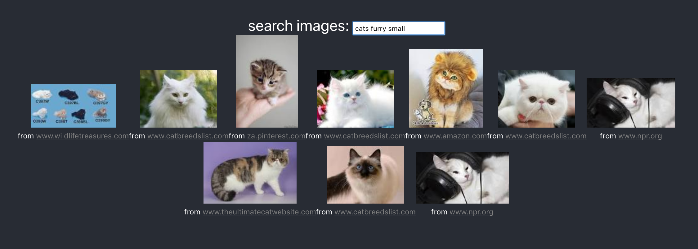

# images-search-experiment

A React project for experimenting with image search.  Uses https://github.com/kevinrobinson/services-edu to search a "custom search engine" for images.

### Demo
https://image-search-experiment.herokuapp.com/

## Getting started
### `npm start`

Runs the app in the development mode. 
Open [http://localhost:3000](http://localhost:3000) to view it in the browser.

The page will reload if you make edits. 
You will also see any lint errors in the console.

This project was bootstrapped with [Create React App](https://github.com/facebook/create-react-app).
